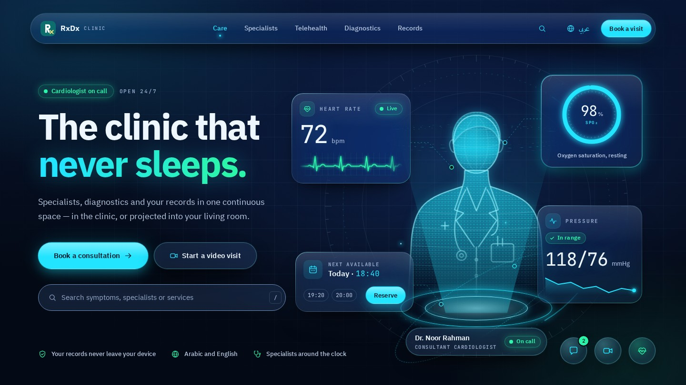

# RxDx Nocturne

A night design system for RxDx's patient-facing clinic surfaces: a midnight ground, glass panels, neon cyan for
actions and electric emerald for anything live. It is kept alongside the clinical theme in `design/theme.css`
and does not change the tool.

Open `showcase.html` in a browser to see the hero above running live. It needs no network; React 18 is in `components/lib/`.

| | |
|---|---|
| `system-readme.md` | the brand book: principles, voice, colour, glass, type, motion, icons, RTL |
| `tokens.json` | colours, type, spacing, radii, shadows, blur, durations and easings |
| `tokens.css` | the same tokens as CSS custom properties and type classes, generated from `tokens.json` |
| `components/` | `bundle.js` (React components on `window.Nocturne`), `bundle.css`, `index.d.ts`, React 18 in `lib/`, and per component a README and the preview the design-system page renders |
| `icons/` | the 20-icon stroke set as SVG files |
| `showcase.html` | the 1440 × 810 clinic hero, composed only from the system |

Fonts come from `design/fonts/` (IBM Plex Sans Arabic and JetBrains Mono), and the mark is the app's `icon.svg`.
